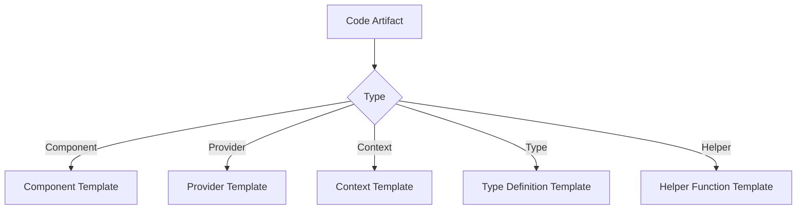

# Documentation Workflow Specification

## Purpose
Standardized documentation for all code artifacts with AI-specific guidance

## File Structure


## Documentation Templates

### 1. React Components
```typescript
/**
 * @summary [One-line purpose]
 * @description [Detailed functionality]
 * 
 * @param {Object} props - Component props
 * @param {Type} props.name - Description
 * 
 * @example
 * // Basic usage
 * <Component prop="value" />
 * 
 * @notes
 * ## AI Usage Guidance:
 * - **Recommended Usage**: [When to use]
 * - **Performance**: [Considerations]
 * - **Dependencies**: [Required providers/contexts]
 * - **Alternatives**: [Other components for similar use cases]
 */
```

### 2. Providers
```typescript
/**
 * @summary [Purpose as provider]
 * @description [State management details]
 * 
 * @param {Object} props - Provider props  
 * @param {ReactNode} props.children - Wrapped components
 * 
 * @notes
 * ## AI Usage Guidance:
 * - **Initialization**: [Setup requirements]
 * - **Error States**: [Handling guidance]
 * - **Dependencies**: [Required services]
 */
```

### 3. Context Definitions
```typescript
/**
 * @summary [Context purpose]
 * @description [Data/state provided]
 * 
 * @property {Type} name - Description
 * 
 * @notes  
 * ## AI Usage Guidance:
 * - **Consumption**: [Preferred hooks]
 * - **Default Values**: [Null state handling]
 */
```

### 4. Type Definitions  
```typescript
/**
 * @summary [Type purpose]
 * @description [Detailed structure]
 * 
 * @property {Type} name - Description
 * 
 * @notes
 * ## AI Usage Guidance:
 * - **Validation**: [Type guards/checks]
 * - **Usage**: [Where applied]
 */
```

### 5. Helper Functions
```typescript
/**
 * @summary [One-line purpose]
 * @description [Detailed behavior]
 * 
 * @param {Type} param - Description
 * @returns {Type} Description
 * @throws {ErrorType} When/why
 * 
 * @example
 * // Basic usage
 * const result = helper(arg);
 * 
 * @notes
 * ## AI Usage Guidance:
 * - **Pure/Impure**: [Side effects]
 * - **Performance**: [Complexity]
 * - **Error Cases**: [Common mistakes]
 */
```

## Component Example (WalletMudProvider)
```typescript
/**
 * @summary Provider for MUD network configuration and wallet state
 * @description Manages MUD network setup, handles initialization errors,
 * and provides context to child components. Wraps MUD and dev tools providers.
 * 
 * @param {Object} props - Component props
 * @param {ReactNode} props.children - Components needing MUD access
 * 
 * @example
 * // App root usage
 * <WalletMudProvider>
 *   <App />
 * </WalletMudProvider>
 * 
 * @notes
 * ## AI Usage Guidance:
 * - **Dependencies**: Requires WalletProvider in component tree
 * - **Error States**: Always check error and loading states
 * - **Initialization**: Setup runs automatically when wallet connects
 * - **Common Pitfalls**:
 *   - Forgetting network checks (isCurrentChain)
 *   - Not handling loading/error states in consumers
 */
export const WalletMudProvider = ({ children }: Props) => {...}
```

## Context Example (WalletMudContext)
```typescript
/**
 * @summary Context for MUD network state
 * @description Provides access to network config, setup status, and errors
 * 
 * @property {NetworkConfig|null} networkConfig - Initialized MUD config
 * @property {boolean} isSettingUp - Network initialization status
 * @property {Error|null} error - Setup error if any
 * 
 * @notes
 * ## AI Usage Guidance:
 * - **Consumption**: Prefer useWalletMud hook over direct context
 * - **Null States**: networkConfig may be null during setup
 * - **Error Handling**: Check error before accessing networkConfig
 */
export type WalletMudContextValue = {...}
```

## Hook Example (useWalletMud)
```typescript
/**
 * @summary Hook to access MUD network state
 * @description Provides MUD config, loading status, and errors
 * 
 * @returns {WalletMudContextValue} Current network state
 * 
 * @example
 * const { networkConfig, isSettingUp, error } = useWalletMud();
 * if (isSettingUp) return <Loader />;
 * 
 * @notes
 * ## AI Usage Guidance:
 * - **Performance**: Lightweight - safe for frequent calls
 * - **Dependencies**: Requires WalletMudProvider parent
 * - **Alternatives**: For simple checks, create derived hooks
 */
export const useWalletMud = () => {...}
```

## Type Definition Example (Props)
```typescript
/**
 * @summary WalletMudProvider component props
 * @description Defines the children prop for WalletMudProvider
 * 
 * @property {ReactNode} children - Child components needing MUD access
 * 
 * @notes
 * ## AI Usage Guidance:
 * - **Validation**: Children must be valid React nodes
 * - **Usage**: Only required prop for WalletMudProvider
 */
type Props = {
  children: React.ReactNode;
};
```

## Helper Function Example (setupMud)
```typescript
/**
 * @summary Initializes MUD network configuration
 * @description Sets up MUD network components and handles errors
 * 
 * @throws {Error} When network setup fails
 * 
 * @notes
 * ## AI Usage Guidance:
 * - **Idempotency**: Won't rerun if networkConfig exists
 * - **Dependencies**: Requires connected wallet clients
 * - **Error Recovery**: Resets error state on retry
 */
const setupMud = async () => {...}
```

## Workflow Rules
1. **Component Documentation**:
   - Start with @summary and @description
   - Document all props with types
   - Include realistic @example
   - Add comprehensive @notes for AI

2. **Context Documentation**:
   - Describe context purpose
   - Document all context values
   - Include null state guidance

3. **Type Documentation**:
   - Explain type's role
   - Document all properties
   - Add validation notes

## 5. Finalization

Once documentation is complete, formulate a commit message following Conventional Commits standards. Present the commit message to the user with options:

```md
<ask_followup_question>
<question>What would you like to do with this commit message?</question>
<options>
["Proceed with the commit", "Reformulate the commit", "Do not commit yet"]
</options>
</ask_followup_question>
```

Example commit message for documentation updates:
```md
<execute_command>
<command>git add . && git commit -m "docs(providers): Add comprehensive documentation for MUD context" -m "This commit adds detailed JSDoc documentation for:
- WalletMudContext and related types
- WalletMudProvider component
- useWalletMud hook
Includes AI-specific usage guidance and examples"</command>
<requires_approval>true</requires_approval>
</execute_command>
```

If the user chooses to reformulate:
```md
<ask_followup_question>
<question>Please provide directions for how you would like to reformulate the commit message.</question>
</ask_followup_question>
```

## Validation Checklist
1. Verify all public APIs are documented
2. Check examples match current implementation
3. Confirm AI guidance covers key usage scenarios
4. Ensure no functional code was modified
