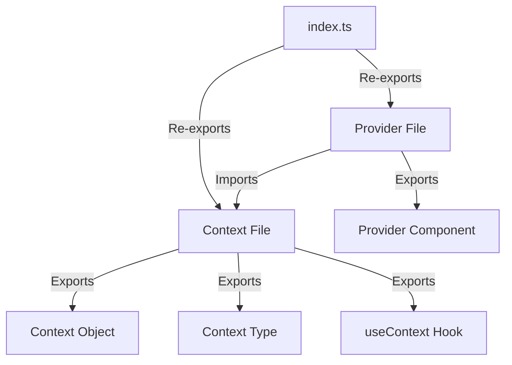

# Context/Provider Structure Standards

## File Separation Pattern


## Implementation Checklist
- [ ] Context file contains ONLY:
  - Context creation (`createContext`)
  - Type definitions
  - Custom hook
- [ ] Provider file contains ONLY:
  - Provider component
  - State management
  - Effect hooks
- [ ] `index.ts` handles all public exports
- [ ] No circular dependencies between files

## Verification Steps
1. TypeScript compilation check
2. Import path validation
3. Linting for proper exports
4. Runtime behavior testing

## Best Practices
- Maintain clear separation of concerns
- Use consistent naming conventions
- Document all exports and imports
- Enforce type safety

## Example Templates

### Context File
```typescript
import React, { createContext, useContext } from 'react';

interface MyContextValue {
  // Context properties
}

const MyContext = createContext<MyContextValue | undefined>(undefined);

export const useMyContext = () => {
  const context = useContext(MyContext);
  if (!context) {
    throw new Error('useMyContext must be used within a MyProvider');
  }
  return context;
};

export default MyContext;
```

### Provider File
```typescript
import React, { useState } from 'react';
import MyContext from './MyContext';

interface MyProviderProps {
  children: React.ReactNode;
}

const MyProvider: React.FC<MyProviderProps> = ({ children }) => {
  const [// State, setState] = useState(// Initial state);

  const value: MyContextValue = {
    // Context values
  };

  return (
    <MyContext.Provider value={value}>
      {children}
    </MyContext.Provider>
  );
};

export default MyProvider;
